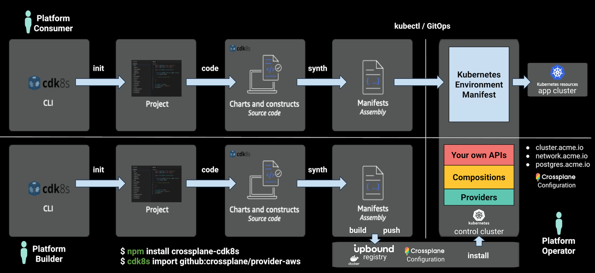
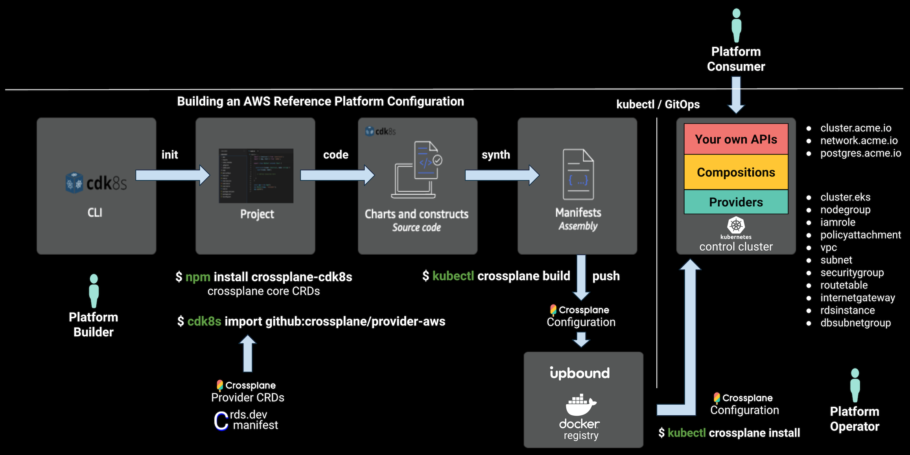
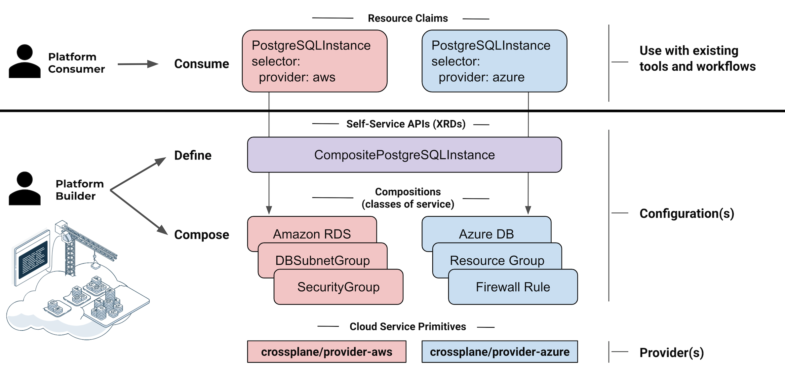

# crossplane-cdk8s (experimental)
Compose your own cloud APIs in Kubernetes using familiar languages including TypeScript, Python, and Java.

## Contents
* [Overview](#overview)
* [Quick Start](#quick-start)
  * [Install Platform Configuration](#install-platform-configuration)
  * [Provision Kubernetes Environment](#provision-kubernetes-environment)
* [Build your own Platform Configuration](#build-your-own-platform-configuration)
  * [Introduction](#introduction)
  * [Write Code](#write-code)
  * [Build](#build)
  * [Push](#push)
  * [Install](#install)
* [Learn More](#learn-more)

## Overview
Kubernetes was designed for extensibility and projects like [Crossplane](https://crossplane.io) have enabled you to define cloud API abstractions in idiomatic Kubernetes YAML, but what if you’re more familiar with TypeScript, Python, or Java? If managing YAML indentation has you down, is there a better way to define CRDs and composite resources that capture your infrastructure best practices and to dynamically generate subnets, CIDR ranges, and more -- without writing complex controllers in Go?

Crossplane-cdk is a new multi-language toolkit built on [cdk8s](https://cdk8s.io) to define CRDs and composite Kubernetes resources with all the benefits of using imperative code and libraries to build declarative resources. Crossplane-cdk can statically generate CRDs and compositions in a CI pipeline -- and future versions will allow `Compositions` to run dynamically behind the Kubernetes API line with Crossplane and a cdk8s sidecar. The result is faster platform definition and app delivery using your languages of choice.



### Example AWS Platform in TypeScript
The examples in this repository include an AWS Platform
[Configuration](https://crossplane.io/docs)
written entirely in TypeScript using `cdk8s`, `crossplane-cdk8s` L2
constructs, and imported `crossplane/provider-aws` resources. Consider
`examples/typescript/platform-ref-aws` as a starting point to build your own
internal cloud platform for use in [Upbound Cloud](https://upbound.io) or
with any self-hosted Crossplane instance.

The example `Configuration` includes platform APIs
(`CompositeResourceDefinitions` and `Compositions`) to provision fully
configured EKS clusters, with secure networking, and stateful cloud services
(RDS) designed to securely connect to the nodes in each EKS cluster -- all
composed using cloud service primitives from the [Crossplane AWS
Provider](https://doc.crds.dev/github.com/crossplane/provider-aws).

App teams can easily spin up a new Kubernetes environment using their
language of choice with a small amount of code. App deployments into
provisioned app clusters can securely connect to the infrastructure they need
using secrets distributed directly to the app namespace.

## Quick Start

### Install Platform Configuration

Typically done by the Platform Ops/SRE team.

#### Create free account in Upbound Cloud

1. Sign up for [Upbound Cloud](https://cloud.upbound.io/register).
1. Create an `Organization` for your teams.

#### Create Platform

1. Create a `Platform` in Upbound Cloud (e.g. dev, staging, or prod).
1. [Connect](https://cloud.upbound.io/docs/getting-started/connect-to-your-platform)
`kubectl` to your `Platform` instance.

Note: the Platform instance should have Crossplane v1.0 or higher as this
`Configuration` relies on package auto-dependency resolution for the
dependencies listed in crossplane.yaml.

#### Install Crossplane CLI
A kubectl extension for convenience.
```console
curl -sL https://raw.githubusercontent.com/crossplane/crossplane/release-1.0/install.sh | sh
cp kubectl-crossplane /usr/local/bin
```

See [Crossplane Docs](https://crossplane.github.io/docs/v1.0/getting-started/install-configure.html) for details.

#### Install Platform Configuration Package

```console
PLATFORM_CONFIG=registry.upbound.io/prasek/platform-ref-aws:v0.2.0

kubectl crossplane install configuration ${PLATFORM_CONFIG}
```

Check install status:

```console
kubectl get pkg
```

It should show:

```console
NAME                                                      INSTALLED   HEALTHY   PACKAGE                                              AGE
configuration.pkg.crossplane.io/prasek-platform-ref-aws   True        True      registry.upbound.io/prasek/platform-ref-aws:v0.2.0   2m8s

NAME                                                  INSTALLED   HEALTHY   PACKAGE                                               AGE
provider.pkg.crossplane.io/crossplane-provider-aws    True        True      registry.upbound.io/crossplane/provider-aws:v0.16.0   107s
provider.pkg.crossplane.io/crossplane-provider-helm   True        True      registry.upbound.io/crossplane/provider-helm:v0.5.0   101s
```

#### Configure Cloud Provider

Clone this repo:
```console
git clone https://github.com/crossplane-contrib/crossplane-cdk.git

cd crossplane-cdk
```

Create `ProviderConfig` and `Secret`

```console
AWS_PROFILE=default && echo -e "[default]\naws_access_key_id = $(aws configure get aws_access_key_id --profile $AWS_PROFILE)\naws_secret_access_key = $(aws configure get aws_secret_access_key --profile $AWS_PROFILE)" > creds.conf

kubectl create secret generic aws-creds -n crossplane-system --from-file=key=./creds.conf

kubectl apply -f examples/typescript/platform-ref-aws/hack/aws-default-provider.yaml
```

### Invite App Teams to your Organization in Upbound Cloud

1. Create a team `Workspace` in Upbound Cloud, named `team1`.
1. Enable self-service APIs in each `Workspace`.
1. Invite app team members and grant access to `Workspaces` in one or more
     `Platforms`.

### Provision Kubernetes Environment

App teams can self-service or platform teams automate deployment in pipelines or GitOps workflows.


#### Join your Organization in Upbound Cloud

1. **Join** your [Upbound Cloud](https://cloud.upbound.io/register)
   `Organization`
1. Verify access to your team `Workspaces`

#### Connect kubectl to your team Workspace

1. [Connect](https://cloud.upbound.io/docs/getting-started/connect-to-your-platform) `kubectl` to the `team1` `Workspace`

Note: the configs in this guide use the `team1` as their `Workspace` / `namespace`.

#### Clone this repo
```console
git clone https://github.com/crossplane-contrib/crossplane-cdk.git

cd crossplane-cdk/examples/typescript/app-dev-ops
```

#### import CRDs from control cluster
```console
cdk8s import --language typescript crds.yaml
```

#### synth the manifest

```console
cdk8s synth                                 
```

should result in:

```console
npx: installed 9 in 1.141s
dist/dev-env.k8s.yaml
```

#### Provision an environment

```console
kubectl apply -f dist/dev-env.k8s.yaml
```

should result in:

```console
cluster.aws.platformref.crossplane.io/eks-cluster created
network.aws.platformref.crossplane.io/network-fabric created
postgresqlinstance.aws.platformref.crossplane.io/postgres-instance created
```

Verify status:

```console
kubectl get claim -n team1
kubectl get composite
kubectl get managed
```

to check progress:

```console
kubectl get managed
```

After a few minutes the resources should be provisioned:

```console
NAME                                                             READY   SYNCED   ID                     VPC                     AGE
securitygroup.ec2.aws.crossplane.io/network-fabric-g2j2c-cn2f6   True    True     sg-06d9fcce822146d21   vpc-0652443832c846e2b   16m

NAME                                                               READY   SYNCED   ID                      VPC                     AGE
internetgateway.ec2.aws.crossplane.io/network-fabric-g2j2c-vkpjc   True    True     igw-0a962c5c3b49455a5   vpc-0652443832c846e2b   17m

NAME                                                   READY   SYNCED   ID                      CIDR             AGE
vpc.ec2.aws.crossplane.io/network-fabric-g2j2c-sdhhk   True    True     vpc-0652443832c846e2b   192.168.0.0/16   17m

NAME                                                      READY   SYNCED   ID                         VPC                     CIDR               AGE
subnet.ec2.aws.crossplane.io/network-fabric-g2j2c-c6ssg   True    True     subnet-0aa8ca74573f003be   vpc-0652443832c846e2b   192.168.0.0/18     16m
subnet.ec2.aws.crossplane.io/network-fabric-g2j2c-h8wsr   True    True     subnet-021a453c2a7fe6630   vpc-0652443832c846e2b   192.168.64.0/18    16m
subnet.ec2.aws.crossplane.io/network-fabric-g2j2c-hm5c4   True    True     subnet-00d5bb3be64f515e3   vpc-0652443832c846e2b   192.168.128.0/18   16m
subnet.ec2.aws.crossplane.io/network-fabric-g2j2c-qhlg9   True    True     subnet-083342ec3e4535375   vpc-0652443832c846e2b   192.168.192.0/18   16m

NAME                                                          READY   SYNCED   ID                      VPC                     AGE
routetable.ec2.aws.crossplane.io/network-fabric-g2j2c-jrklg   True    True     rtb-08652a83ea56abc20   vpc-0652443832c846e2b   16m

NAME                                                    READY   SYNCED   AGE
cluster.eks.aws.crossplane.io/eks-cluster-dfqpc-lkm2w   True    True     16m

NAME                                                      READY   SYNCED   CLUSTER                    AGE
nodegroup.eks.aws.crossplane.io/eks-cluster-dfqpc-xsrwl   True    True     platform-ref-aws-cluster   16m

NAME                                                         READY   SYNCED   AGE
iamrole.identity.aws.crossplane.io/eks-cluster-dfqpc-258d5   True    True     17m
iamrole.identity.aws.crossplane.io/eks-cluster-dfqpc-sg5zc   True    True     17m

NAME                                                                         READY   SYNCED   ROLENAME                  POLICYARN                                                    AGE
iamrolepolicyattachment.identity.aws.crossplane.io/eks-cluster-dfqpc-6rp7s   True    True     eks-cluster-dfqpc-258d5   arn:aws:iam::aws:policy/AmazonEC2ContainerRegistryReadOnly   16m
iamrolepolicyattachment.identity.aws.crossplane.io/eks-cluster-dfqpc-hmqxc   True    True     eks-cluster-dfqpc-258d5   arn:aws:iam::aws:policy/AmazonEKS_CNI_Policy                 16m
iamrolepolicyattachment.identity.aws.crossplane.io/eks-cluster-dfqpc-plbvj   True    True     eks-cluster-dfqpc-sg5zc   arn:aws:iam::aws:policy/AmazonEKSClusterPolicy               17m
iamrolepolicyattachment.identity.aws.crossplane.io/eks-cluster-dfqpc-v4zrh   True    True     eks-cluster-dfqpc-258d5   arn:aws:iam::aws:policy/AmazonEKSWorkerNodePolicy            16m

NAME                                                                     READY   SYNCED   AGE
dbsubnetgroup.database.aws.crossplane.io/postgres-instance-jx4gv-dkfdc   True    True     17m

NAME                                                                   READY   SYNCED   STATE       ENGINE     VERSION   AGE
rdsinstance.database.aws.crossplane.io/postgres-instance-jx4gv-kp857   True    True     available   postgres   9.6.19    17m
```

### Cleanup & Uninstall

#### Cleanup Resources

```console
kubectl delete -f dist/dev-env.k8s.yaml
```

which should result in the `claims` being deleted:
```console
cluster.aws.platformref.crossplane.io "eks-cluster" deleted
network.aws.platformref.crossplane.io "network-fabric" deleted
postgresqlinstance.aws.platformref.crossplane.io "postgres-instance" deleted
```

Verify all underlying resources have been cleanly deleted:

```console
kubectl get managed
```

which after a few minutes should report:

```console
No resources found
```

#### Uninstall Provider & Platform Configuration

```console
kubectl delete pkg
```

#### Uninstall Crossplane kubectl plugin

```console
rm /usr/local/bin/kubectl-crossplane*
```

## Build your own Platform Configuration

### Introduction

To extend the existing example platform in TypeScript we'll be using this workflow:



#### APIs in this Platform Configuration* `Cluster` - provision a fully configured EKS cluster
    * `EKSCluster`
    * `NodeGroup`
    * `IAMRole`
    * `IAMRolePolicyAttachment`
    * `HelmReleases` for Prometheus and other cluster services.
* `Network` - fabric for a `Cluster` to securely connect to Data Services and
  the Internet.
    * `VPC`
    * `Subnet`
    * `InternetGateway`
    * `RouteTable`
    * `SecurityGroup`
* `PostgreSQLInstance` - provision a PostgreSQL RDS instance that securely connects to a `Cluster`
    * `RDSInstance`
    * `DBSubnetGroup`

#### Core Crossplane Resources
`crossplane-cdk8s` provides cdk8s L2 constructs for core Crossplane types:

* The Platform `Configuration` Crossplane package metadata.
* `CompositeResourceDefinitions` (XRDs) define the platform's self-service
   APIs - e.g. `CompositePostgreSQLInstance`.
* `Compositions` offer the classes-of-service supported for each self-service
   API - e.g. `Standard`, `Performance`, `Replicated`.



Crossplane `Providers` include the cloud service primitives (AWS, Azure, GCP,
Alibaba) used in a `Composition`.

Learn more about `Composition` in the [Crossplane
Docs](https://crossplane.github.io/docs/v0.13/getting-started/compose-infrastructure.html).

### Write Code

Since we're using the `crossplane-cdk8s` repo and the `crossplane/provider-aws` resources have already been imported you can skip directly to [build and push](#build).

To update the imported `crossplane/provider-aws` resources:
```console
cd crossplane-cdk/examples/typescript/platform-ref-aws

cdk8s import -l typescript github.com:crossplane/provider-aws
# or
cdk8s import -l typescript github.com:crossplane/provider-aws@0.15.0
```

### Build

#### Clone GitHub repo:

```console
git clone https://github.com/crossplane-contrib/crossplane-cdk.git

yarn install

cd examples/typescript/platform-ref-aws
```

#### Synth package contents

```console
cdk8s synth
```

should return

```console
npx: installed 9 in 1.378s
dist/cluster-api.k8s.yaml
dist/crossplane.k8s.yaml
dist/network-api.k8s.yaml
dist/postgres-api.k8s.yaml
```

#### Build package

```console
cd dist

kubectl crossplane build configuration --name package.xpkg
```

### Push
Create a `Repository` called `platform-ref-aws` in your Upbound Cloud `Organization`:

Set these to match your settings:

```console
UPBOUND_ORG=acme
UPBOUND_ACCOUNT_EMAIL=me@acme.io
REPO=platform-ref-aws
VERSION_TAG=v0.2.0
REGISTRY=registry.upbound.io
PLATFORM_CONFIG=${REGISTRY:+$REGISTRY/}${UPBOUND_ORG}/${REPO}:${VERSION_TAG}
```

Login to your container registry.

```console
docker login ${REGISTRY} -u ${UPBOUND_ACCOUNT_EMAIL}
```

Push package to registry.

```console
kubectl crossplane push configuration ${PLATFORM_CONFIG} -f package.xpkg
```

### Install
Install package into an Upbound `Platform` instance.

```console
kubectl crossplane install configuration ${PLATFORM_CONFIG}
```

The AWS cloud service primitives that can be used in a `Composition` today are
listed in the [Crossplane AWS Provider
Docs](https://doc.crds.dev/github.com/crossplane/provider-aws).

To learn more see [Configuration
Packages](https://crossplane.io/docs/v0.13/getting-started/package-infrastructure.html).

## Learn More

If you're interested in building your own reference platform for your company,
we'd love to hear from you and chat. You can setup some time with us at
info@upbound.io.

For Crossplane questions, drop by [slack.crossplane.io](https://slack.crossplane.io), and say hi!