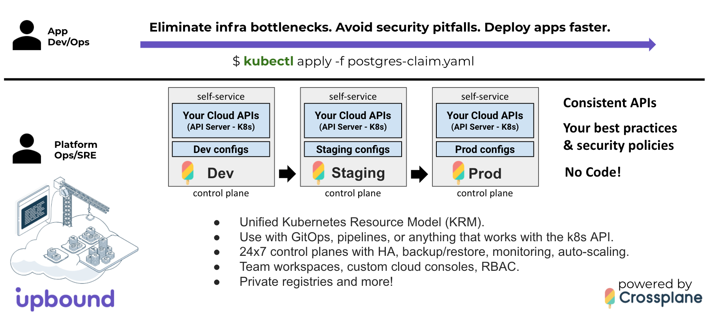
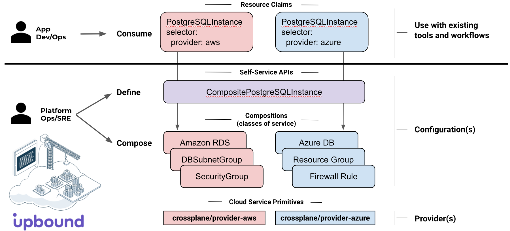
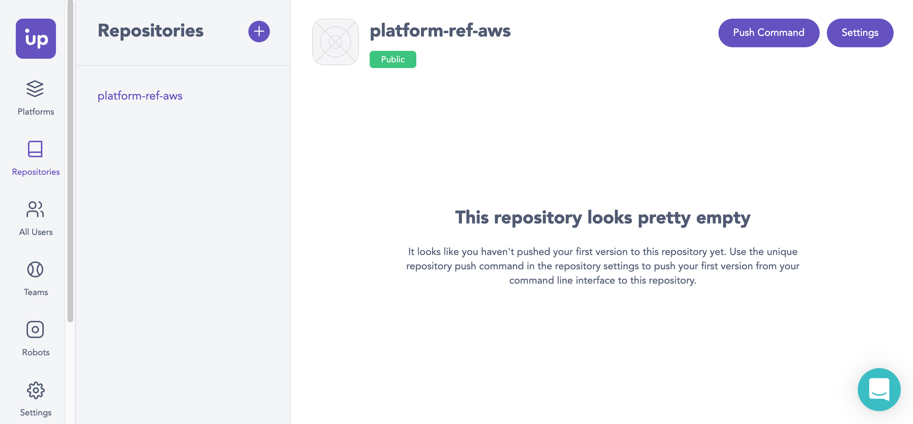

# AWS Reference Platform for Kubernetes + Data Services

This repository contains a reference AWS Platform
[Configuration](https://crossplane.io/docs/v0.13/getting-started/package-infrastructure.html)
for use as a starting point in [Upbound Cloud](https://upbound.io) to build,
run and operate your own internal cloud platform and offer a self-service
console and API to your internal teams. It provides platform APIs to provision
fully configured EKS clusters, with secure networking, and stateful cloud
services (RDS) designed to securely connect to the nodes in each EKS cluster --
all composed using cloud service primitives from the [Crossplane AWS
Provider](https://doc.crds.dev/github.com/crossplane/provider-aws). App
deployments can securely connect to the infrastructure they need using secrets
distributed directly to the app namespace.

## Contents

* [Upbound Cloud](#upbound-cloud)
* [Build Your Own Internal Cloud Platform](#build-your-own-internal-cloud-platform)
* [Quick Start](#quick-start)
* [Platform Ops/SRE: Run your own internal cloud platform](#platform-opssre-run-your-own-internal-cloud-platform)
  * [App Dev/Ops: Consume the infrastructure you need using kubectl](#app-devops-consume-the-infrastructure-you-need-using-kubectl)
  * [APIs in this Configuration](#apis-in-this-configuration)
* [Customize for your Organization](#customize-for-your-organization)
* [What's Next](#whats-next)
* [Learn More](#learn-more)
* [Local Dev Guide](#local-dev-guide)

## Upbound Cloud

**New Reference Platform support launching Nov 10th 2020!**



What if you could eliminate infrastructure bottlenecks, security pitfalls, and
deliver apps faster by providing your teams with self-service APIs that
encapsulate your best practices and security policies, so they can quickly
provision the infrastructure they need using a custom cloud console, `kubectl`,
or deployment pipelines and GitOps workflows -- all without writing code?

[Upbound Cloud](https://upbound.io) enables you to do just that, powered by the
open source [Crossplane](https://crossplane.io) project.

Consistent self-service APIs can be provided across dev, staging, and
production environments, making it easy for app teams to get the infrastructure
they need using vetted infrastructure configurations that meet the standards
of your organization.

## Build Your Own Internal Cloud Platform

App teams can provision the infrastructure they need with a single YAML file
alongside `Deployments` and `Services` using existing tools and workflows
including tools like `kubectl` and Flux to consume your platform's self-service
APIs.

The Platform `Configuration` defines the self-service APIs and
classes-of-service for each API:

* `CompositeResourceDefinitions` (XRDs) define the platform's self-service
   APIs - e.g. `CompositePostgreSQLInstance`.
* `Compositions` offer the classes-of-service supported for each self-service
   API - e.g. `Standard`, `Performance`, `Replicated`.



Crossplane `Providers` include the cloud service primitives (AWS, Azure, GCP,
Alibaba) used in a `Composition`.

Learn more about `Composition` in the [Crossplane
Docs](https://crossplane.github.io/docs/v0.13/getting-started/compose-infrastructure.html).

## Quick Start

### Platform Ops/SRE: Run your own internal cloud platform

#### Create a free account in Upbound Cloud

1. Sign up for [Upbound Cloud](https://cloud.upbound.io/register).
1. Create an `Organization` for your teams.

#### Create a Platform instance in Upbound Cloud

1. Create a `Platform` in Upbound Cloud (e.g. dev, staging, or prod).
1. Connect `kubectl` to your `Platform` instance.

#### Install the Crossplane kubectl extension (for convenience)

```console
curl -sL https://raw.githubusercontent.com/crossplane/crossplane/master/install.sh | sh
cp kubectl-crossplane /usr/local/bin
```

#### Install Providers into your Platform

```console
PROVIDER_AWS=crossplane/provider-aws:v0.14.0
PROVIDER_HELM=crossplane/provider-helm:v0.3.6

kubectl crossplane install provider ${PROVIDER_AWS}
kubectl crossplane install provider ${PROVIDER_HELM}
kubectl get pkg
```

Create `ProviderConfig` and `Secret`

```console
AWS_PROFILE=default && echo -e "[default]\naws_access_key_id = $(aws configure get aws_access_key_id --profile $AWS_PROFILE)\naws_secret_access_key = $(aws configure get aws_secret_access_key --profile $AWS_PROFILE)" > creds.conf

kubectl create secret generic aws-creds -n crossplane-system --from-file=key=./creds.conf
kubectl apply -f examples/aws-default-provider.yaml
```

#### Install the Platform Configuration

```console
PLATFORM_CONFIG=registry.upbound.io/upbound/platform-ref-aws:v0.0.8

kubectl crossplane install configuration ${PLATFORM_CONFIG}
kubectl get pkg
```

#### Create Network Fabric

```console
kubectl apply -f examples/network.yaml
```

Verify status:

```console
kubectl get claim
kubectl get composite
kubectl get managed
```

#### Invite App Teams to you Organization in Upbound Cloud

1. Create a team `Workspace` in Upbound Cloud, named `team1`.
1. Enable self-service APIs in each `Workspace`.
1. Invite app team members and grant access to `Workspaces` in one or more
     `Platforms`.

### App Dev/Ops: Consume the infrastructure you need using kubectl

#### Join your Organization in Upbound Cloud

1. **Join** your [Upbound Cloud](https://cloud.upbound.io/register)
   `Organization`
1. Verify access to your team `Workspaces`

#### Provision a PostgreSQLInstance in your team Workspace GUI console

1. Browse the available self-service APIs (XRDs) in your team `Workspace`
1. Provision a `PostgreSQLInstance` using the custom generated GUI for your
Platform `Configuration`
1. View status / details in your `Workspace` GUI console

#### Connect kubectl to your team Workspace

1. Connect `kubectl` to a `Workspace` from the self-service GUI console in a
`Workspace`

#### Provision a PostgreSQLInstance using kubectl

```console
kubectl apply -f examples/postgres-claim.yaml
```

Verify status:

```console
kubectl get claim -n team1
kubectl get composite
kubectl get managed
```

### Cleanup & Uninstall

#### Cleanup Resources

Delete resources created through the `Workspace` GUI:

* From the `Workspace` GUI using the ellipsis menu in the resource view.
* Using `kubectl delete -n team1 <claim-name>`.

Delete resources created using `kubectl`:

```console
kubectl delete -f examples/postgres-claim.yaml
kubectl delete -f examples/network.yaml
```

Verify all underlying resources have been cleanly deleted:

```console
kubectl get managed
```

#### Uninstall Provider & Platform Configuration

```console
kubectl delete configurations.pkg.crossplane.io platform-ref-aws
kubectl delete providers.pkg.crossplane.io provider-aws
kubectl delete providers.pkg.crossplane.io provider-helm
```

#### Uninstall Crossplane kubectl plugin

```console
rm /usr/local/bin/kubectl-crossplane*
```

## APIs in this Configuration

* `Cluster` - provision a fully configured EKS cluster
  * [definition.yaml](cluster/definition.yaml)
  * [composition.yaml](cluster/composition.yaml) includes (transitively):
    * `EKSCluster`
    * `NodeGroup`
    * `IAMRole`
    * `IAMRolePolicyAttachment`
    * `HelmReleases` for Prometheus and other cluster services.
* `Network` - fabric for a `Cluster` to securely connect to Data Services and
  the Internet.
  * [definition.yaml](network/definition.yaml)
  * [composition.yaml](network/composition.yaml) includes:
    * `VPC`
    * `Subnet`
    * `InternetGateway`
    * `RouteTable`
    * `SecurityGroup`
* `PostgreSQLInstance` - provision a PostgreSQL RDS instance that securely connects to a `Cluster`
  * [definition.yaml](database/postgres/definition.yaml)
  * [composition.yaml](database/postgres/composition.yaml) includes:
    * `RDSInstance`
    * `DBSubnetGroup`

## Customize for your Organization

Create a `Repository` called `platform-ref-aws` in your Upbound Cloud `Organization`:



Set these to match your settings:

```console
UPBOUND_ORG=acme
UPBOUND_ACCOUNT_EMAIL=me@acme.io
REPO=platform-ref-aws
VERSION_TAG=v0.0.8
REGISTRY=registry.upbound.io
PLATFORM_CONFIG=${REGISTRY:+$REGISTRY/}${UPBOUND_ORG}/${REPO}:${VERSION_TAG}
```

Clone the GitHub repo.

```console
git clone https://github.com/upbound/platform-ref-aws.git
cd platform-ref-aws
```

Login to your container registry.

```console
docker login ${REGISTRY} -u ${UPBOUND_ACCOUNT_EMAIL}
```

Build package.

```console
kubectl crossplane build configuration --name package.xpkg --ignore "examples/*,hack/*"
```

Push package to registry.

```console
kubectl crossplane push configuration ${PLATFORM_CONFIG} -f package.xpkg
```

Install package into an Upbound `Platform` instance.

```console
kubectl crossplane install configuration ${PLATFORM_CONFIG}
```

The AWS cloud service primitives that can be used in a `Composition` today are
listed in the [Crossplane AWS Provider
Docs](https://doc.crds.dev/github.com/crossplane/provider-aws).

To learn more see [Configuration
Packages](https://crossplane.io/docs/v0.13/getting-started/package-infrastructure.html).

## What's Next

The Crossplane community is targeting a v1.0 release with 90% coverage of all
Cloud APIs by end of year 2020 with multiple workstreams in flight:

* Code gen of native Crossplane providers by adapting existing codegen pipelines:
  * ACK Code Generation of the Crossplane `provider-aws`
    * https://github.com/jaypipes/aws-controllers-k8s/tree/crossplane
  * Azure Code Generation of the Crossplane `provider-azure`
    * https://github.com/matthchr/k8s-infra/tree/crossplane-hacking
* Code gen of Crossplane providers that wrap the stateless Terraform providers
  * Clouds that don't have code gen pipelines
    * https://github.com/crossplane/crossplane/issues/262

## Learn More

If you're interested in building your own reference platform for your company,
we'd love to hear from you and chat. You can setup some time with us at
info@upbound.io.

For Crossplane questions, drop by [slack.crossplane.io](https://slack.crossplane.io), and say hi!
